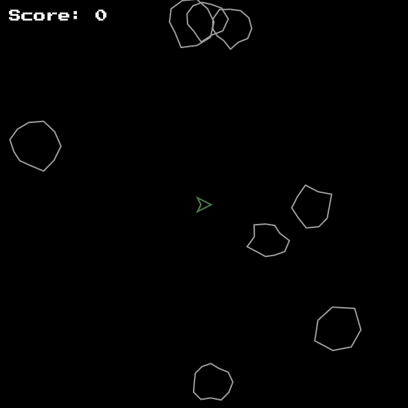

# Flutter Asteroids Game

An Asteroids game built with Flutter. Blast your way through a field of asteroids, avoid collisions, and shoot lasers to survive. Have fun playing!



## Features

- Simple and addictive gameplay.
- Dynamic asteroid generation.
- Ship with thrust and shooting capabilities.
- Smooth animations and controls.

## Getting Started

To run the game, follow these steps:

1. Clone this repository:

   ```bash
   git clone https://github.com/your-username/flutter-asteroids.git
   ```

2. Navigate to the project directory:

   ```bash
   cd flutter-asteroids
   ```

3. Run the app:

   ```bash
    flutter run
   ```

## Gameplay Controls

- **Left Arrow**: Rotate ship left.
- **Right Arrow**: Rotate ship right.
- **Up Arrow**: Thrust ship forward.
- **Spacebar**: Shoot lasers.

## Contributing

Contributions are welcome! Please feel free to submit a Pull Request.

## Credits

This project was inspired by the [Asteroids game](<https://en.wikipedia.org/wiki/Asteroids_(video_game)>) developed by Atari in 1979.

Special thanks to [The Coding Train](https://www.youtube.com/@TheCodingTrain/featured) for the [Asteroids Coding Challenge](https://www.youtube.com/watch?v=hacZU523FyM).

## License

This project is licensed under the MIT License - see the [LICENSE](LICENSE) file for details.
